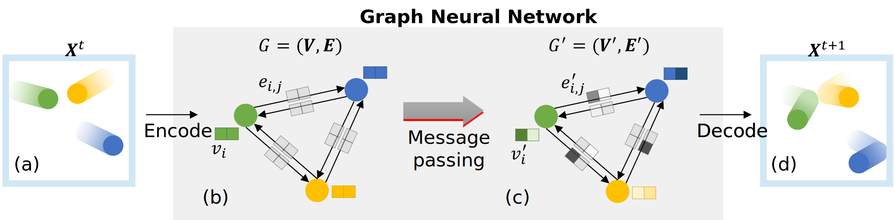

Our research on Scientific Machine Learning (SciML) and differentiable programming focuses on discovering new physics and developing fast algorithms to accelerate numerical simulations.

## Open Source Code implementations of SciML
 
### Graph Network Simulator (GNS)

 

Graph Network-based Simulator (GNS) is a framework for developing generalizable, efficient, and accurate machine learning (ML)-based surrogate models for particulate and fluid systems using Graph Neural Networks (GNNs). GNS code is a viable surrogate for numerical methods such as Material Point Method, Smooth Particle Hydrodynamics and Computational Fluid dynamics. GNS exploits distributed data parallelism to achieve fast multi-GPU training. The GNS code can handle complex boundary conditions and multi-material interactions.

### Differentiable MPM (DiffMPM) 

 

DiffMPM (Differentiable Material Point Method) is an innovative approach that brings differentiability to the Material Point Method (MPM). By enabling gradients to flow through MPM simulations, DiffMPM unlocks a new frontier in physics-based optimization and machine learning tasks, bridging the gap between computational mechanics and deep learning paradigms. Leveraging the core principles of MPM, which provides a robust mechanism for simulating complex materials and large-deformation problems, DiffMPM enhances this capability by allowing for end-to-end optimization of simulation parameters, thereby opening doors to novel applications in additive manufacturing, robotics, and design. Our research group delves deep into exploring the potential of DiffMPM and its implications in both theoretical advancements and practical applications.

## Simulations

## Videos
X-AI and Machine Learning, 2022 SimCenter-DesignSafe AI workshop
<iframe width="560" height="315" src="https://www.youtube.com/embed/NO8D_vyFzBE" title="YouTube video player" frameborder="0" allow="accelerometer; autoplay; clipboard-write; encrypted-media; gyroscope; picture-in-picture" allowfullscreen></iframe>

## Team
<!-- Team filled from _data/members.yaml-->
   

    
      
        
          

            

            

            <h4>{{ member.name }}</h4>	
            {{ member.position }}, {{member.uni }} 
	 <a h   ref="mailto:{{ member.email }}">{{ member.email }}</a>
          

        
      
    
   

<!-- End team -->

## Publications
<!-- Publications filled automatically -->




  
    

    
      
    
    

  


